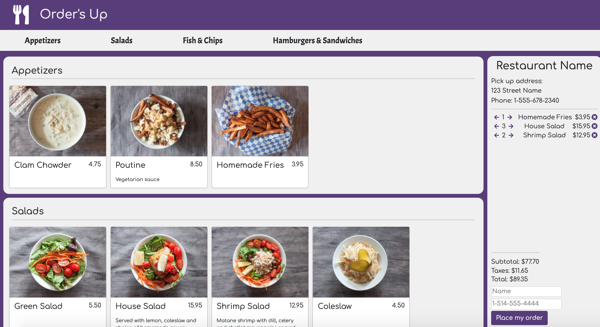
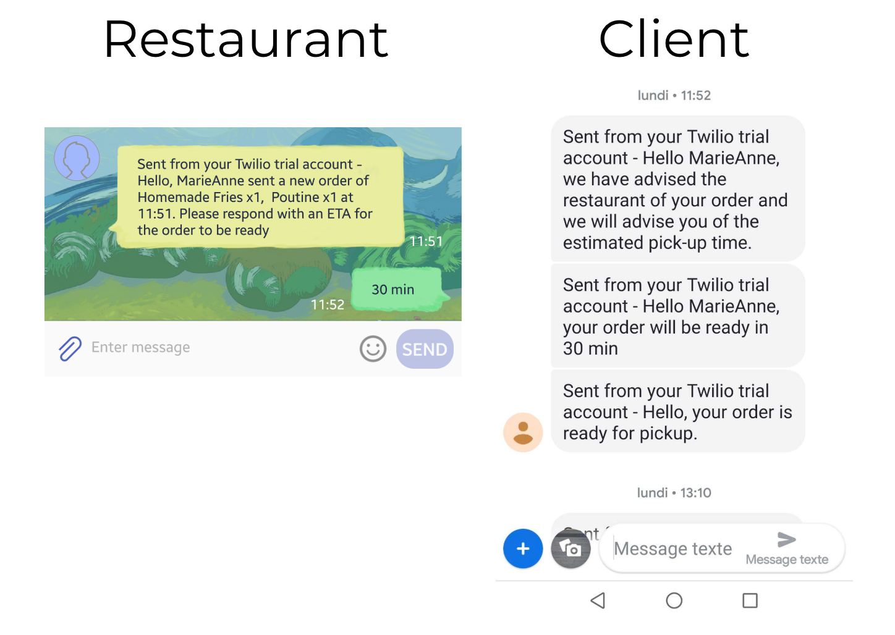
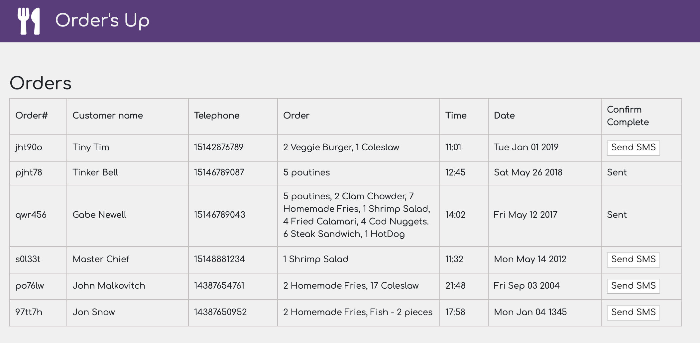

# Order's Up Food Ordering App

A food ordering app for a single restaurant where clients can select food items to be added to their cart, update the quantity of each item in the cart or remove an item. After placing an order, the client will receive a text message confirming their order was sent to the restaurant and the restaurant receives a text message with the client's order. If the restaurant provides a time estimate for when the order will be ready for pick-up, it will be forwarded to the client vis SMS. The restaurant also has an order management table where they can send a final SMS to the client when the food is ready for pickup.

## Languages and frameworks

A web application built with Node.js, Express, Ajax, jQuery, HTML, Bootstrap & SASS, Knex.js and PostgreSQL, localStorage and the Twilio API

## Pictures

## Getting Started

1. Install all the dependencies with npm install
2. Set up the database by running knex migrate:latest and knex seed:run
3. Visit http://localhost:8080/

To use the Twilio features:

1. Sign up for a Twilio account
2. Get a Twilio phone number
3. Add your Twilio Account and Token numbers
4. Install ngrok
5. Add your ngork adress
6. Run npm start
7. Put your Twilio phone number in the "from:" areas in server.js (lines 156, 167)
8. Put a real phone number in the "to" area in server.js (line 168). This phone number will be the restaurant
9. Enter a different real phone number when placing an order. 

## Dependencies

    - body-parser 1.19.0 or above
    - dotenv 8.0.0 or above
    - ejs 2.6.1 or above
    - express 4.17.0 or above
    - knex 0.16.5 or above
    - knex-logger 0.1.0 or above
    - morgan 1.9.1 or above
    - node-sass-middleware 0.11.0 or above
    - pg 6.0.2 or above
    - twilio 3.31.0 or above
